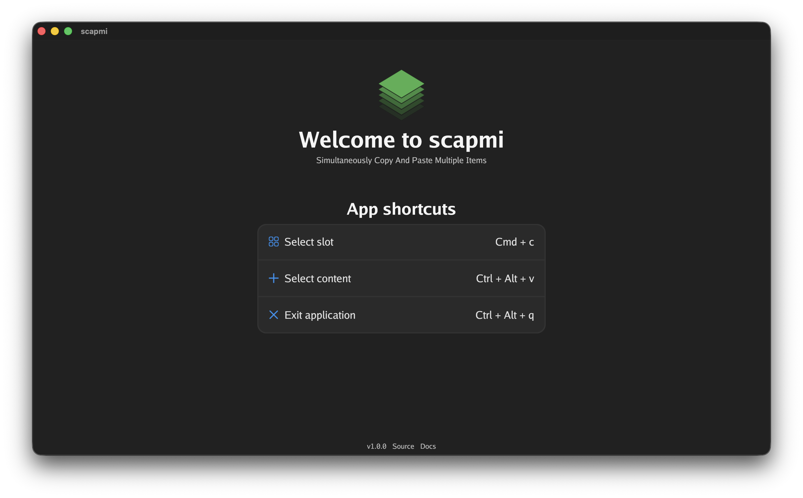
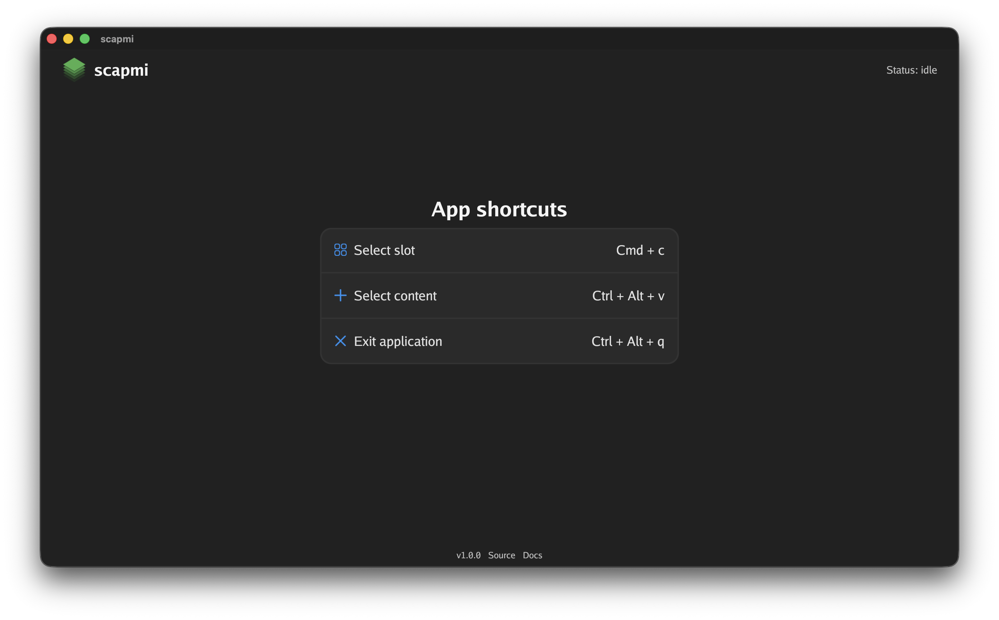
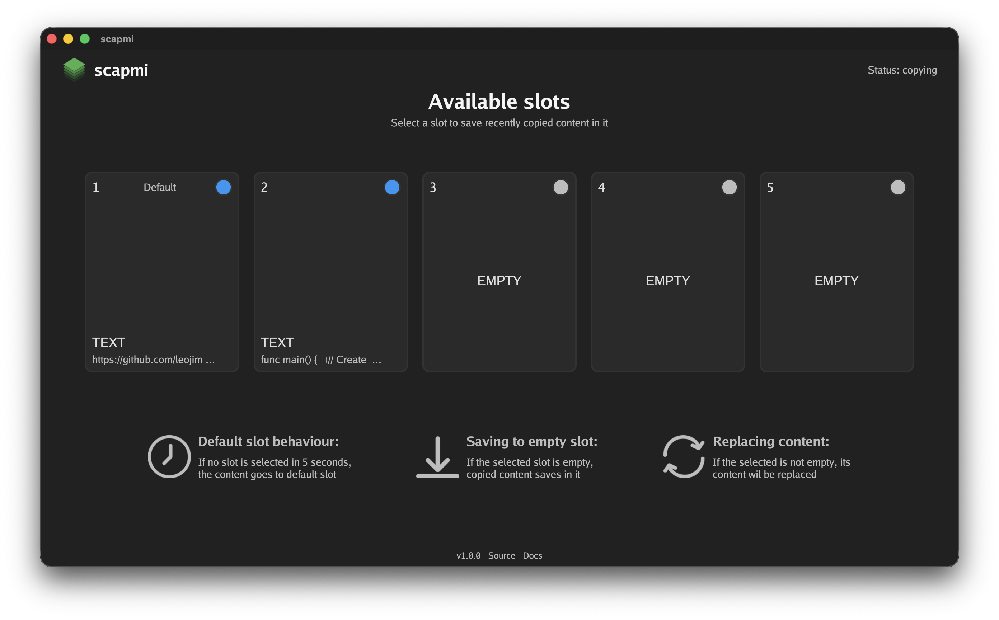
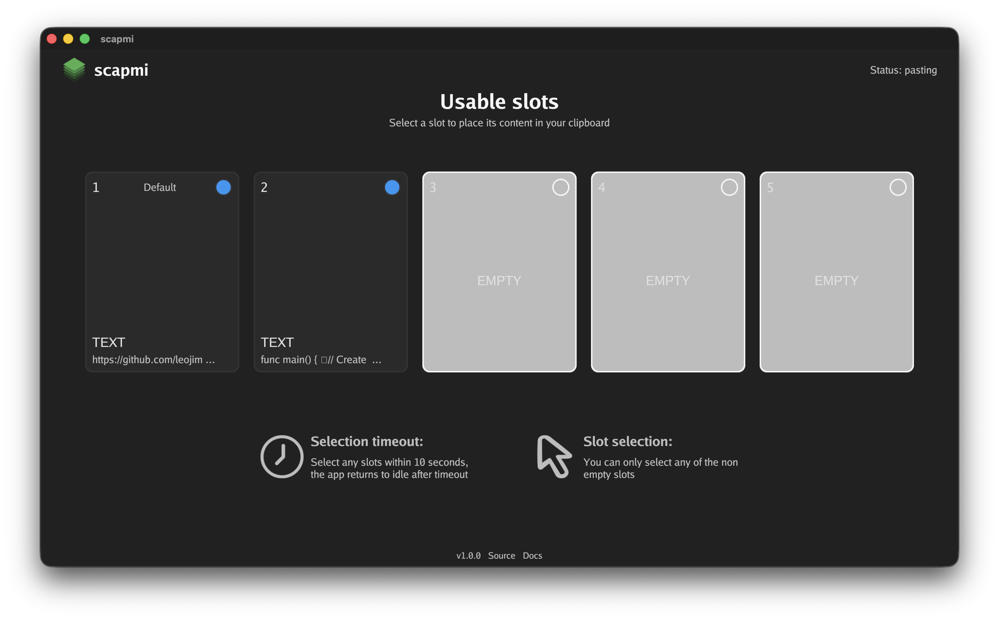

<p align="center">
    
</p>

# scapmi

scapmi (Simultaneously Copy And Paste Multiple Items) is a lightweight desktop application that stores and manages multiple items from your clipboard. Save up to 5 copied items (text or images) into dedicated slots, then quickly retrieve any of them ready to paste them.

## Features

- **Five dedicated slots** available for storing copied content (text or images)
- **Global keyboard shortcuts** accessible from any application
- **Instant clipboard detection** when you copy new content
- **Automatic slot selection** with a 5-second timer during copying
- **10-second pasting window** for selecting multiple slots consecutively
- **Intuitive and simple GUI** for managing slots
- **Lossless preservation** of text and images without modification

## Installation

### Option 1: Download binary (recommended)

**Note:** Currently there is only one binary available compiled for macOS (darwin-arm64) due to packages compatibitily problems.

1. **Download binary:** Visit the release [scapmi v1.0.0](https://github.com/leojimenezg/scapmi/releases/tag/v1.0.0) and download the binary

2. **Trust the binary:**
    ```bash
    xattr -d com.apple.quarantine scapmi
    ```

3. **Make it executable:**
    ```bash
    chmod +x scapmi
    ```

3. **Run the application:**
    ```bash
    ./scapmi
    ```

4. **Grant permissions:** 
Allow clipboard access and keyboard event detection when prompted

### Option 2: Build from source

**Prerequisites:** Make sure you have installed **Go 1.25.X** or a newer version in your system

1. **Clone the repository:**
Open your prefered terminal and clone the project to your local machine
    ```bash
    git clone https://github.com/leojimenezg/scapmi.git
    ```

2. **Navigate into the project directory:**
    ```bash
    cd scapmi
    ```

3. **Compile and install the project:**
    ```bash
    go install .
    ```

4. **Run the Application:**
Execute the binary to launch the scapmi application
    ```bash
    scapmi
    ```

5. **Grant permissions:** 
Allow clipboard access and keyboard event detection when prompted

## Application Guide

### Overview

scapmi runs in the background and raises to focus when you copy content or use keyboard shortcuts. The app has four states:
- **Welcome** - Initial screen on first launch
- **Idle** - Waiting for user action
- **Copying** - Clipboard change detected, awaiting slot selection
- **Pasting** - Opened via `Ctrl + Alt + v` shortcut for content retrieval

### Basic Workflow

1. **Launch scapmi** - Run the binary from terminal
2. **Copy content** - Use `Cmd + c` to copy text or images
3. **Select slot** - Window appears automatically. Click a slot (1-5) within 5 seconds, or defaults to slot 1
4. **Paste content** - Press `Ctrl + Alt + v` to open pasting window. Click any filled slot to load it into your clipboard
5. **Paste normally** - Use `Cmd + v` to paste the retrieved content
6. **Exit application** - Press `Ctrl + Alt + q` to quit

### Keyboard Shortcuts

| Shortcut | Action |
|----------|--------|
| `Cmd + c` | Copy content and trigger slot selection |
| `Ctrl + Alt + v` | Open pasting window |
| `Ctrl + Alt + q` | Exit application |

### Tips

- **Default slot** - Slot 1 is auto-selected after 5 seconds during copying
- **Multiple selections** - Pasting window stays open for 10 seconds for consecutive selections
- **Slot indicators** - Empty slots grayed out, filled slots show blue indicator
- **Session-only storage** - All slot content is cleared when application closes

## GUI

### Welcome Screen

*Initial view on first launch with app overview and shortcuts.*



### Idle Screen

*Default state when waiting for user action.*



### Copying Screen

*Appears when clipboard change is detected.*




### Pasting Screen

*Activated via `Ctrl + Alt + v` shortcut.*



## Notes

- I created this project initially for fun and to explore GUI development in Go, but it ended up solving a real need of mine
- The code is purpose-built for this application's specific requirements, though I tried to keep components reusable and configurable where practical
- All custom widgets accept `int` for sizing but internally handle proper conversion to density-independent pixels and actual screen pixels
- You might notice slight latency between copying and the window gaining focus. This is normal behavior when detecting clipboard changes and unavoidable with the current approach
- The default font (Go font) has limited Unicode coverage, some special characters or emojis may not render correctly in slot previews, though the actual content is preserved intact

## Useful Resources

- [Gio UI Framework](https://gioui.org/) - A declarative, framework for building graphical user interfaces in Go
- [Gio UI Package](https://pkg.go.dev/gioui.org) - Official API documentation for the Gio UI framework
- [Clipboard Package](https://pkg.go.dev/golang.design/x/clipboard) - Go library that provides access to the system clipboard
- [GoHook Package](https://pkg.go.dev/github.com/robotn/gohook) - A library for capturing global keyboard and mouse events
- [Browser Package](https://pkg.go.dev/github.com/pkg/browser) - Lightweight Go package for opening URLs in the default system browser
